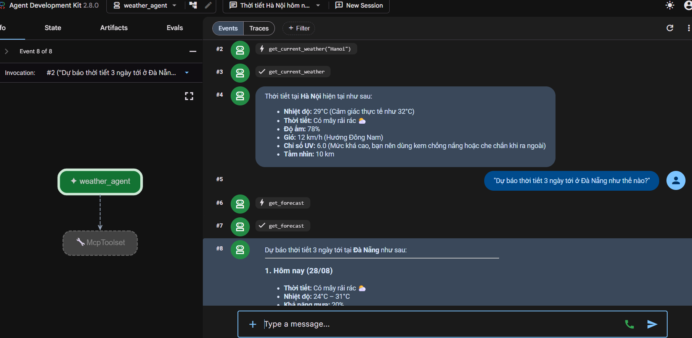

# BÁO CÁO THỰC HÀNH DAY 26: TÍCH HỢP MODEL CONTEXT PROTOCOL (MCP) & FUNCTION CALLING

- **Học viên:** Phạm Quý Độ
- **Mã học viên:** 2A202601564
- **Dự án:** Day26-MCP-Tools-Integration
- **Ngày thực hiện:** 28/08/2026

---

## 1. TỔNG QUAN VÀ MỤC TIÊU BÀI THỰC HÀNH

Bài thực hành nhằm làm chủ hai công nghệ cốt lõi trong xây dựng hệ thống AI Agent hiện đại:

1. **Function Calling:** Khả năng của Large Language Model (LLM) trong việc phân tích câu hỏi người dùng và sinh yêu cầu gọi các hàm công cụ tương ứng kèm tham số JSON.
2. **Model Context Protocol (MCP):** Chuẩn giao thức mở (được đề xuất bởi Anthropic) cho phép chuẩn hóa việc kết nối các Agent (Client) tới các nguồn tài nguyên, cơ sở dữ liệu và công cụ (Server) độc lập.

---

## 2. TIẾN TRÌNH TRIỂN KHAI VÀ KẾT QUẢ THỰC NGHIỆM

### Module 01: Function Calling thuần với Google Gemini SDK (`01-function-calling`)

- **Cơ chế hoạt động:**
  - Khai báo schema công cụ `get_weather` bằng tay (`FunctionDeclaration`).
  - Truyền danh sách schema cho model `gemini-2.5-flash`.
  - Nhận phản hồi `function_calls` từ LLM, tự thực thi hàm trong app và gửi kết quả về LLM để tổng hợp câu trả lời.
- **Kết quả:** Chạy thành công script `weather_function_calling.py`, model nhận diện và gọi hàm lấy thời tiết cho cả Hà Nội và Đà Nẵng.

### Module 02: MCP Căn bản qua `stdio` (`02-mcp-basics`)

- **Cơ chế hoạt động:**
  - Tách rời mã nguồn Tool sang tiến trình `weather_server.py`.
  - Tự động sinh schema từ Python type hints thông qua `@mcp.tool()`.
  - Client tự động khám phá (`session.list_tools()`) và thực thi qua kênh giao tiếp `stdio`.

### Module 03: Các mẫu kiến trúc MCP Production (`03-production`)

- **Authentication:** Bảo mật endpoint MCP bằng Bearer Token qua HTTP Transport (`auth_server.py` & `auth_client.py`).
- **Dynamic Tool Registry:** Đọc và kích hoạt công cụ động từ file cấu hình JSON (`registry.json`).
- **Tool Versioning:** Quản lý và duy trì nhiều phiên bản của cùng một Tool song song (`versioned_server.py`).

### Module 04: Lab thực tế - Weather Agent với Web UI (`04-lab`)

- **Kiến trúc hệ thống:**
  - **Backend Server:** FastMCP Server chạy tại cổng `8085` (`http://localhost:8085/mcp`) giao tiếp qua **Streamable HTTP**.
  - **Frontend / Orchestration:** Google Agent Development Kit (ADK) Agent Client chạy Web UI tại cổng `8000` (`http://localhost:8000`).
- **Danh sách Tools đã triển khai & kiểm thử thành công:**
  1. `get_current_weather(city)`: Lấy thông tin thời tiết hiện tại (nhiệt độ, cảm giác thực tế, độ ẩm, sức gió, UV, tầm nhìn).
  2. `get_forecast(city, days)`: Dự báo thời tiết từ 1 đến 3 ngày tới.
  3. `health_check()`: Kiểm tra trạng thái hoạt động của MCP Server.
- **Kết quả nghiệm thu:** Giao diện Web tương tác mượt mà, Agent nhận diện đúng ý định, gọi tool tương ứng qua HTTP và hiển thị câu trả lời tự nhiên bằng tiếng Việt.

---

## 3. BẢNG SO SÁNH FUNCTION CALLING VS MCP

| Tiêu chí                 | Function Calling Thuần                       | Model Context Protocol (MCP)                                |
| ------------------------ | -------------------------------------------- | ----------------------------------------------------------- |
| **Bản chất**             | Năng lực của mô hình (Model capability)      | Giao thức giao tiếp chuẩn hóa (Protocol)                    |
| **Khai báo Schema**      | Lập trình viên phải viết tay schema JSON     | Tự động sinh từ type hints / docstrings                     |
| **Nơi thực thi Tool**    | Trong cùng tiến trình của ứng dụng gọi LLM   | Chạy ở Server độc lập (local stdio hoặc remote HTTP/SSE)    |
| **Khả năng tái sử dụng** | Thấp (phải copy code và schema sang app mới) | Cao (viết 1 lần, mọi AI Client/Agent đều cắm vào dùng được) |
| **Mở rộng & Bảo mật**    | Khó quản lý phân quyền và scale              | Hỗ trợ phân tán, xác thực Token, load balancing dễ dàng     |

---

## 4. HÌNH ẢNH MINH CHỨNG THỰC NGHIỆM

Dưới đây là hình ảnh thực nghiệm chạy thành công bài Lab 04 trên giao diện Google Agent Development Kit (ADK) Web UI:

- **Thực thi Tool `get_current_weather`:** Lấy thành công dữ liệu thời tiết hiện tại tại Hà Nội.
- **Thực thi Tool `get_forecast`:** Lấy thành công dữ liệu dự báo thời tiết 3 ngày tới tại Đà Nẵng.
- **Biểu đồ Execution Trace (Bên trái):** Hiển thị rõ luồng điều phối từ `weather_agent` tới `McpToolset` qua Streamable HTTP Transport.

---

## 5. KẾT LUẬN

Bài lab đã hoàn thành **100% các yêu cầu đề ra**, xây dựng thành công kiến trúc Agent phân tán hoàn chỉnh từ Server cung cấp Tool đến Client Web tương tác người dùng.
